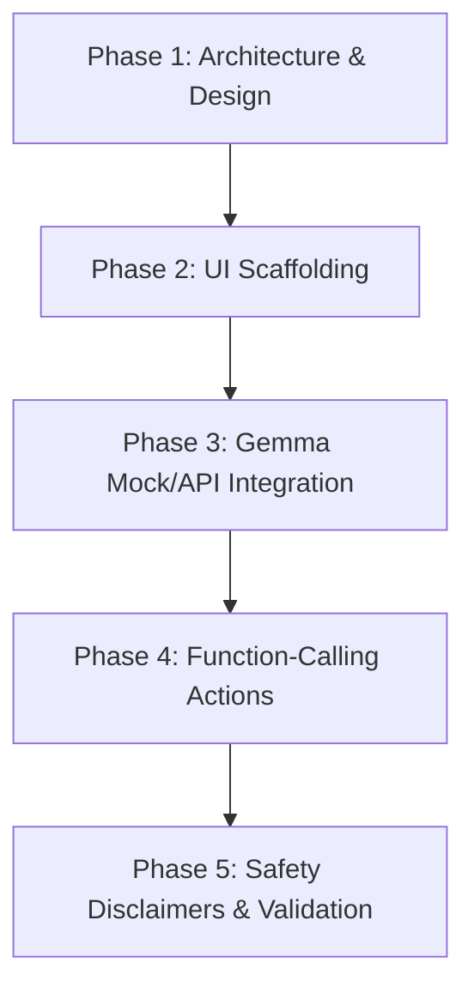

# 🏗️ Sanjeevani: Project Architecture & Implementation Plan

This document details the architecture, data schemas, clinical logic, and step-by-step plan for building **Sanjeevani**, our multilingual health triage assistant.

---

## 🎯 Target Population & Language Dialects
* **Target Population**: Rural and semi-urban communities in southern India (Tamil Nadu, Kerala, and Andhra Pradesh).
* **Primary Languages & Dialects**: 
  * **Tamil**: Colloquial spoken Tamil (Kongu Tamil, southern Tamil, and Madras slang).
  * **Malayalam**: Spoken Malayalam (Malabar, Travancore, and central regional variations).
  * **Telugu**: Colloquial spoken Telugu (Rayalaseema, Telangana, and coastal Andhra dialects).
* **Why**: Rural health clinics in these southern states are often understaffed, and digital medical information is rarely available in colloquial regional phrasing (e.g., Telugu: *"Kaduphu noppiga undhi"* for stomach ache; Malayalam: *"Vayaru vedhana"* for stomach ache; Tamil: *"Vayiru valikkuthu"* for stomach ache).

---

## 🩺 Evidence-Based Triage Logic
Sanjeevani maps inputs strictly to **Triage Severity Levels**, aligned with the **World Health Organization (WHO) Integrated Adult and Child Triage (IACT)** guidelines.

We define three distinct categories:

| Severity Level | Color Code | Action Required | Clinical Criteria Example |
| :--- | :--- | :--- | :--- |
| **RED (Emergency)** | Red | Immediate medical attention (go to nearest hospital/call ambulance) | Chest pain, difficulty breathing, unconsciousness, severe blood loss. |
| **YELLOW (Urgent)** | Yellow | Consult a medical professional at a Primary Health Center (PHC) within 24 hours | Persistent high fever, moderate abdominal pain, signs of infection. |
| **GREEN (Self-Care)** | Green | Home monitoring and self-care guidelines | Mild cold, simple scratches, temporary muscle strain, mild headache. |

---

## 🤖 Gemma 4 Integration & Function Calling
Gemma 4 is the core decision-making engine. It performs two key operations:
1. **Interpretation**: Translates the regional dialect/informal symptom description into clean clinical terms and maps it to a severity level.
2. **Function Calling**: Triggers appropriate actions based on the severity:
   * `showEmergencyContacts()`: Triggers immediate local emergency services (RED).
   * `findNearbyPHC(location)`: Searches for local Primary Health Centers (YELLOW/GREEN).
   * `generateTriagePass(patientData)`: Compiles symptoms, severity, and rationale into a printable diagnostic/triage slip.

### Expected JSON Output Schema
```json
{
  "detected_language": "Tamil",
  "original_symptoms": "வயிர் வலிக்குது அப்புறம் வாந்தி வர மாதிரி இருக்கு",
  "translated_symptoms": "Stomach ache and nausea",
  "severity": "YELLOW",
  "clinical_rationale": "Patient reports abdominal pain and nausea without red-flag symptoms like chest pain or difficulty breathing. Suggests checking for gastrointestinal issues.",
  "recommended_action": "Consult a healthcare provider at the nearest Primary Health Center (PHC) within 24 hours.",
  "trigger_function": {
    "name": "findNearbyPHC",
    "parameters": {
      "location": "Coimbatore, Tamil Nadu"
    }
  }
}
```

---

## 💻 Tech Stack & UI Design
* **Frontend Framework**: Vite + React.
* **Styling**: Vanilla CSS with custom CSS variables (aesthetics: rich dark mode, glassmorphism UI, accessible large text, sound effects/audio readout).
* **Audio Layer**: Simulated voice input (speech-to-text) and audio readout for accessibility.
* **State Management**: Simple React Context.

---

## 🚀 Step-by-Step Implementation Roadmap



1. **Step 1: Scaffold UI**: Set up the Vite + React workspace structure.
2. **Step 2: Core Theme & Layout**: Establish css variables, sidebar navigation, triage panel, and chat container.
3. **Step 3: Dialect Translation & Decision Logic**: Write mock Gemma 4 response mapping for common dialect phrases.
4. **Step 4: Function Actions**: Implement nearby hospital finder and Triage Pass exporter.
5. **Step 5: Safety Disclaimers & Audits**: Enforce prominent emergency banners and error handling.
